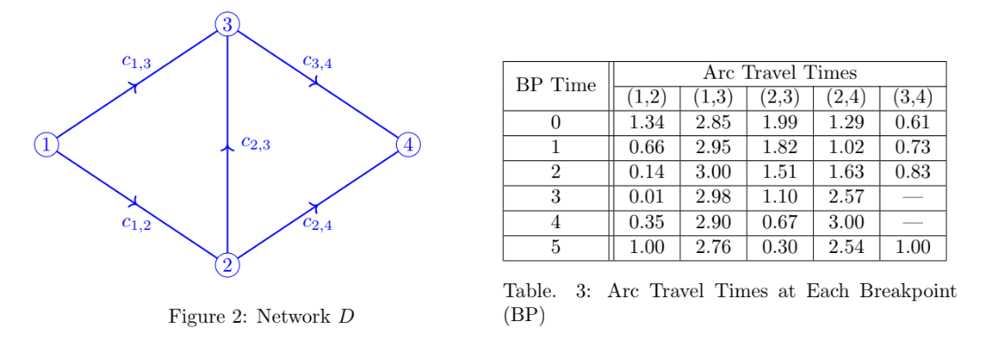
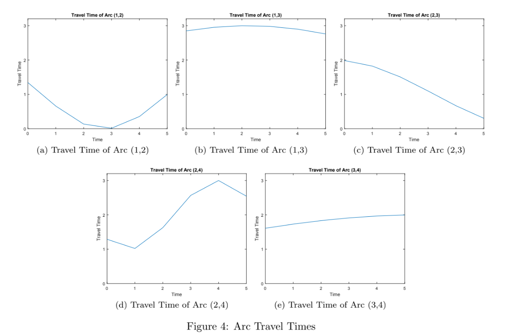
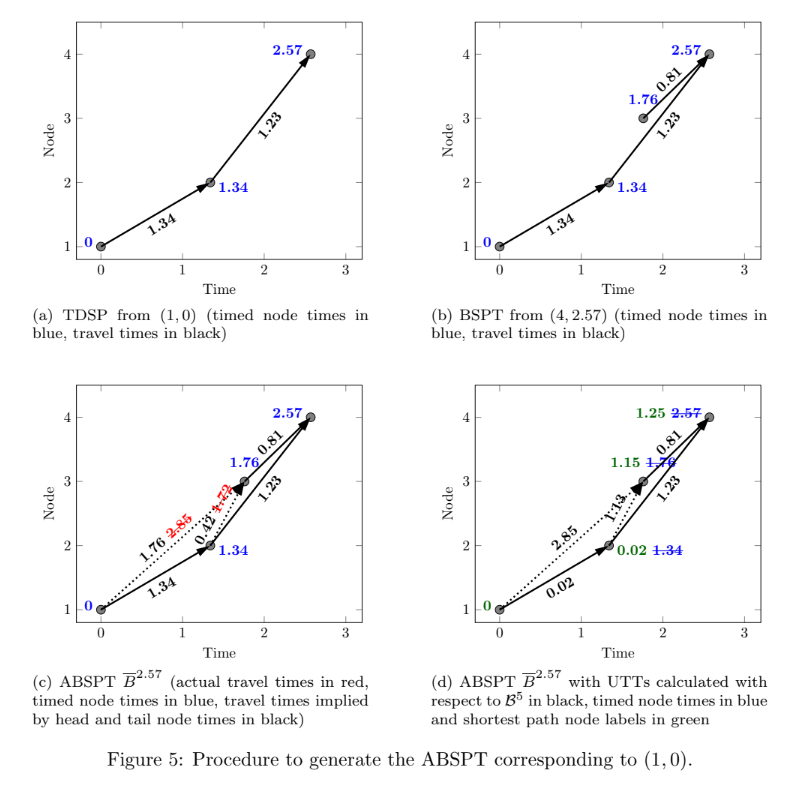

---
#Tùy chỉnh thông tin
university: Đại học Quốc gia Hà Nội # Tên đại học
collage: Trường Đại học Khoa học Tự nhiên # Tên trường
faculty: Khoa Toán - Cơ - Tin học # Tên khoa
subject: Khóa luận tốt nghiệp # Tên môn học
major: Khoa học máy tính và thông tin # Ngành học
title: Phương pháp rời rạc động giải các bài toán tìm đường đi có yếu tố thời gian # Tên đề tài
instructor: Vũ Đức Minh # Tên giáo viên hướng dẫn
author:
  - name: Bùi Khánh Duy # Tên tác giả
    id: 20001898 # Mã số sinh viên

position: Hà Nội
day: 24 # Ngày
month: 4 # Tháng
year: 2024 # Năm
logo: "logo/logo.jpg"
---

# Giải bài toán MDP

Để dễ trình bày, bài luận sẽ chỉ tập trung vào trường hợp thuộc tính *FIFO n*gặt. Với trường hợp *FIFO* không ngặt, chỉ cần vài sự thay đổi nhỏ và chứng minh lại tính đúng đắn là có thể áp dụng.

## Ví dụ

Xét mạng ở hình 2 với các hàm thời gian di chuyển được biểu diễn ở hình 4. Khung thời gian là $[0, 5]$. Hầu hết các cung có điểm dừng là số nguyên. Ngoại lệ là cung $(3, 4)$ chỉ có điểm dừng tại $0, 1, 2$ và $5$. **Phụ lục 8** cung cấp chi tiết về các hàm thời gian di chuyển và hàm đảo chiều của chúng.

Hình 2: Mạng $D$; Bảng 3: Bảng Thời gian di chuyển với mỗi điểm điểm dừng.



Hình 4: Biểu đồ đường cho Hàm thời gian di chuyển.

## Công thức chi tiết

Cho thời điểm $t$ bất kì thuộc khoảng $[0, T]$ biểu diễn thời gian đi đến đỉnh $n$, ta có thể xây dựng BSPT tương ứng. BSPT là một Mạng thời gian-không gian (**TEN**) được kí hiệu là $B^t$, có gốc là $(n, t)$. Cây này được định nghĩa bởi tập hợp các nút[^2] $(i, t_i)$ với $i \in N$ và $t_i \in (-\infty, T]$, tập hợp các cung[^3] $((i, t_i), (j, t_j))$ thỏa mãn các điều kiện sau:
- Với mỗi $i\in N$, chỉ tồn tại $t_i$ là thời gian khởi hành muộn nhất để đi từ $i$ đến $n$. Lúc này $(i, t_i)\in B^t$,
- $(i, j) \in A$,
- $t_i + c_{i, j}(t_i) = t_j$, và
- **Chỉ có một đường đi duy nhất** từ $i$ đến $n$ trong $B^t$. Đường đi này được xác định bởi nghiệm của *TDSPP* (được gọi là *TDSP*) bắt đầu từ $i$ tại thời gian $t_i$ và kết thúc ở $n$.
**BSPT** được tìm ra bằng cách giải bài toán *TDSPP*, bằng cách áp dụng thuật toán SSSP với một vài điều chỉnh đơn giản. BSPT cho đỉnh $4$ tại thời gian $t=2.57$ được biểu diễn ở hình 5(b). Mạng TEN này bao gồm các nút $\{(1, 0.00), (2, 1.34), (3, 1.76), (4, 2.57)\}$[^1] và các cung 
$(1, 2), (2, 4), (3, 4)$ được xác định bởi các nút theo thời gian.

Hình 5: quy trình tạo ABSPT ứng với đỉnh xuất phát (1,0)

Lưu ý khi xây dựng BSPT $B^t$:
- tại một thời điểm $t \in [0, T]$ **bất kỳ,** có thể tồn tại một số đỉnh $i$ không thể đi đến đỉnh $n$ bất kể với thời gian nào $> 0$.
- **Trường hợp đơn giản:** Nếu đỉnh đang xét $i$ ở thời gian $t = T$, ta có thể loại bỏ nút $i$ khỏi mạng ngay từ bước xử lý trước.
- **Trường hợp phức tạp:** Để đơn giản hóa cho bước tiếp theo, ta giả sử rằng *BSPT* chứa một nút cho mọi đỉnh $i \in N$. Để thực hiện điều này, hàm thời gian di chuyển $c_{i,j}(t)$ được mở rộng sang $t < 0$ (âm): Với mọi cung $(i, j)$ trong mạng $A$ và mọi thời điểm $t < 0$, ta gán giá trị của $c_{i,j}(t) = c_{i,j}(0)$. Do đó, các nút $(i, t_i)$ với $t_i<0$ cũng có thể được thêm vào mạng $B^t$.

Thuật toán DDD được xây dựng dựa trên những đặc điểm sau của các BSPT:
- **Tính chất FIFO:** Nếu hai nút $(i, s)$ trong $B^t$ và $(i, s’)$ trong $B^{t’}$ với $t’ > t$ thì $s’ > s$, (Điều này có nghĩa là nếu một nút đến muộn hơn trong $B^t$, nó cũng sẽ đến càng muộn hơn trong $B^{t’}$).
- **Đường đi theo thời gian tối thiểu:** Bất kỳ đường đi có thời gian tối thiểu nào từ đỉnh $1$ đến $n$, trong đó đến đỉnh $n$ tại thời gian $t$ hoặc muộn hơn, đều được biểu diễn thành một dãy các nút trong $B^t$. Nghĩa là, với mỗi cặp $(i, s)$ trên đường đi sẽ tồn tại một nút $(i, s’) \in B^t$ thỏa mãn $s’ \le s$ (thời gian đến tại $s'$ không trễ hơn s). Lưu ý rằng dãy các nút này không nhất thiết phải theo các cung trong $B^t$.

Từ những đặc điểm trên, ta có định nghĩa sau:

Cây **ABSPT** là một mạng **TEN** được hình thành bằng cách thêm các cung vào **BSPT** có sẵn. Cụ thể, ta thêm cung $((i, t_i), (j, t_j))$ cho mọi cặp nút $(i, j) \in A$ nếu cả $(i, t_i)$ và $(j, t_j)$ đều có trong **BSPT**. Theo định nghĩa của BSPT, ta có:
- $t_i + c_{i,j}(t_i) \ge t_j$ cho tất cả các cung trong **ABSPT**.
- Nói cách khác, $t_j - t_i \le c_{i,j}(t_i)$ với mọi $((i, t_i), (j, t_j))$ trong **ABSPT**
Hình 5(c) minh họa cho ABSPT của $B^t$ với $t = 2.57$. Trong hình, $c_{i,j}(t_i)$ được gạch chéo màu đỏ và thay thế bằng giá trị $t_j - t_i$ trên tất cả các cung mới được thêm vào để tạo thành **ABSPT**. Các cung mới có kí hiệu ba chấm. Ta kí hiệu ABSPT được tạo nên từ $B^t$ là $\overline{\cal B}^t$. 

Thuật toán của tôi hoạt động bằng cách duy trì một danh sách các ABSPT sắp xếp theo thứ tự thời gian tăng dần. Khởi tạo danh sách bằng hai ABSPT:
- ABSPT cho **thời gian đến nút đích sớm nhất có thể**.
- ABSPT cho **thời gian kết thúc của khung thời gian.**
Hai thời gian này xác định nên khoảng giới hạn của nghiệm khả thi: tất cả các đường đi hợp lệ theo khung thời gian đều phải đến đích trong giới hạn này. Thuật toán sẽ liên tục tạo thêm ABSPT để chia nhỏ giới hạn đấy. Ví dụ với khung thời gian $t\in [0,5]$, hai ABSPT ban đầu là  $\overline{\cal B}^{2.57}$ và $\overline{\cal B}^{5}$.  $\overline{\cal B}^{5}$ chứa các nút theo thời gian $(1, 2.90), (2, 2.92), (3, 4.05)$ và $(4, 5)$.
Quan sát sau đây được dùng để so sánh hai ABSPT liên tiếp: Giả sử $\overline{\cal B}^t$ và $\overline{\cal B}^{t^+}$ liên tiếp có thời gian kết thúc tương ứng là $t$ và $t^+$, $t^+>t$. Đối với mỗi cung $((i, s_i), (j, s_j))$ trong $\overline{\cal B}^t$, thuật toán tính ra UTT kết hợp với $\overline{\cal B}^{t^+}$ theo công thức:
$$    \underline c_{(i, s_i),(j, s_j)}=\min_\tau\{c_{ij}(\tau)|s_i\le\tau\le s_i^+\},$$
với $(i, s_i^+)$ là nút cho đỉnh $i$ trong ABSPT kế tiếp. Hình 5(d) minh họa các giá trị **UTT** trong ví dụ với $t = 2.57$ và $t^+  = 5$ (các cung màu đen). Chúng được tính dựa trên đoạn thời gian tạo thành từ các nút trong $\overline{\cal B}^{2.57}$ và $\overline{\cal B}^{5}$. Ví dụ: UTT cho cung $((1, 0),(2, 1.34))$ là $\min c_{1, 2}(\tau) = 0.02$ với $\tau \in [0, 2.90]$, và $\tau$ nằm ở cuối của đoạn. Ngược lại, UTT cho cung $((1, 0),(3, 1.76))$ là $\min c_{1,3}(\tau) = 2.85$$ với $\tau \in [0, 4.05]$ và $\tau$ nằm ở đầu đoạn.

Đường đi có chứa UTT nhỏ nhất trong số các ABSPT là **cận dưới** của bất kì nghiệm khả thi nào. Ví dụ, trong hình 5(d), các nút thuộc đường đi có **UTT** nhỏ nhất trong $\overline{\cal B}^{2.57}$ được tô màu xanh. Nhãn của nút cuối là $1.25$, nghĩa là không có đường dẫn hợp lệ nào đến nút cuối trong khung thời gian từ $2.57$ đến $5$ có thời gian di chuyển nhỏ hơn $1.25$, tương ứng với cận dưới là $1.25$.

Bằng việc thêm vào danh sách các ABSPT với thời gian kết thúc lớn hơn ABSPT của cận dưới hiện tại, ta có thể cải thiện (ít nhất là không làm giảm) các giá trị UTT.

Từ ABSPT ta luôn tìm được **cận trên** cho thời gian thực hiện. Theo định nghĩa, nếu $(1, t_1)$ và $(n, t_n)$ là hai nút đầu và cuối tương ứng, thì $t_n - t_1$ sẽ là cận trên và thuật toán sẽ lưu lại cận trên tốt nhất. Trong ví dụ: $\overline{\cal B}^{2.57}$ có thời gian thực hiện là $2.57$ và $\overline{\cal B}^{5}$ là $2.10$. Từ đây ta có cận dưới tốt nhất là $1.25$ và cận trên tốt nhất là $2.10$.

Chỉ với việc áp dụng phương pháp tìm kiếm cận dưới và cận trên từ danh sách kết hợp với thêm các ABSPT mới cho khoảng thời gian ngay sau ABSPT cận dưới, thuật toán sẽ luôn hội tụ về nghiệm tối ưu. Ví dụ như thời gian hội tụ về giữa của khoảng thời gian mới. Thêm vào đó, Foschini et al. (2014) đã chỉ ra rằng luôn tồn tại một phương pháp tối ưu sử dụng các điều dừng của hàm thời gian di chuyển. Nhờ quan sát này, ta có thể tạo ra thời gian kết thúc cho các ABSPT mới một cách nhanh chóng hơn đồng thời loại bỏ các khoảng thời gian phụ không cần thiết. Cũng vì vậy mà thuật toán sẽ dừng lại sau hữu hạn các lần lặp. 


Bây giờ sẽ là phần trình bày cách sử dụng các điểm dừng trong hàm thời gian di chuyển để xây dựng thuật toán.

## Điểm dừng

Đầu tiên, khởi tạo các ABSPT chứa ít nhất một nút $(i, t)$ là điểm dừng. Cụ thể: $(1, 0)$ nằm trong ABSPT thứ nhất và $(n, T)$ nằm trong ABSPT thứ 2. Các nút $(1, 0$ và $(n, T)$ đều được coi là điểm dừng.

Xét hai ABSPT liên tiếp trong danh sách, giả sử ABSPT trước có nút $(i, t_i)$ và ABSPT sau có nút là $(i, t_i^+)$ đồng thời ABSPT trước là cận dưới hiện tại.

Có các trường hợp sau đây sẽ xảy ra:

- **Trường hợp 1:** $\exists (i, j) \in A\ |\ \tau_i:t_i < \tau_i < t_i^+$ với điểm dừng $\tau_i$. Lúc này, ta nói điểm $(i, \tau_i)$ nằm giữa hai ABSPT. Xây dựng ABSPT mới như sau:
	1. Tìm TDSP xuất phát từ $i$ thời điểm $\tau_i$ đến $n$.
	2. Giả sử TDSP đi đến $n$ tại thời điểm $\tau_n$. Lúc này BSPT từ $\tau_n$ là $\cal B ^{\tau_n}$ phải có nút $(i, \tau_i)$. Ta nói các cung đã được hoàn thành và $\overline {\cal B} ^{\tau_n}$ là ABSPT tương ứng với nút $(i, \tau_i)$.
	Theo tính chất của việc tạo danh sách các ABSPT, điều kiện $t_n < \tau_n < t_n^+$ phải thoả mãn. Lúc này ABSPT tương ứng với $(i, \tau_i)$ được chèn vào giữa hai ABSPT có thời gian kết thúc lần lượt là $t_n$ và $t_n^+$.
	
- **Trường hợp 2:** $\nexists (i, j)\in A\ |\ \tau_i: t_i < \tau_i < t_i^+$, không có điểm dừng nằm giữa hai ABSPT.
	 Lúc này, ta có thể kết luận trạng thái ABSPT được giải quyết và không có ABSPT mới được thêm vào.
## Thuật toán 1

Tổng quan thuật toán như sau:

1. Xác định một ABSPT bất kì từ danh sách, giả sử là $\overline {\cal B} ^{t}$ chứa các nút $(j, t_j)$ với mỗi đỉnh $j$.
2. Tính toán:
	1. Hàm cận trên $computeUB(\overline {\cal B} ^{t}) = t_n -t_1$.
	2. Hàm cận dưới $computeLB(\overline {\cal B} ^{t}):$ 
		1. Xây dựng tập các UTT cho mỗi cung trong $\overline {\cal B} ^{t}$ kết hợp với ABSPT kế tiếp,
		2. Tìm đường đi UTT nhỏ nhất từ nút $(1, t_1)$ đến $(n, t_n)$ trong ABSPT,
		3. Trả về giá trị tìm được.
	3. Lưu lại các giá trị $LB^t \gets computeLB(\overline {\cal B} ^{t}), UB^t \gets computeUB(\overline {\cal B} ^{t})$
3. Đối với ABSPT cuối cùng trong danh sách: $\overline {\cal B} ^{T}$:
	1. Các UTT sẽ là thời gian di chuyển thực tế nếu cung có trong BSPT, và là vô cực trong các trường hợp khác,
	2. Cận dưới $LB^T$ = $UB^T$ (bằng cận trên).

Vì thuật toán 1 thực chất là một họ các thuật toán nên không đề cập đến phương án chọn điểm dừng khi có nhiều lựa chọn. Phần 5.2 sẽ đề cập đến các cách chọn được sử dụng.


## Mã giả

Thuật toán 1.

```pseudo

\begin{algorithm}

\caption{Dynamic Discretization Discovery (DDD) Algorithm for the MDP}
\begin{algorithmic}
\Input{digraph $D=(N,A)$, latest time $T$, arc travel time function $c_{i,j}(t)$ for all $t\in [0, T]$, each $(i, j) \in A$}
\Output{minimum duration path from node $1$ to $n$ departing and arriving at times in $[0, T]$}

\State Solve the TDSP starting from $(1, 0)$ to determine $t_0$, the earliest time that $n$ can be reached ;
\State Initialize ordered list of ABSPTs: set $L \leftarrow (\overline{B}^{t_0}, \overline{B}^{T})$  ;
\State $UB \leftarrow \min\{ computeUB(\overline{B}^{t_0}), computeUB(\overline{B}^{T})\}$ ;
\State $LB^{t_0} \leftarrow computeLB(\overline{B}^{t_0})$ ;
\State Set $LB \leftarrow LB^{t_0}$, set $t \leftarrow t_0$ and set $t^+ \leftarrow T$ ;
\While{$(LB < UB)$}

	\If{some breakpoints $(j, \tau)$ lies between $\overline{B}^{t}$ and $\overline{B}^{t^+}$}
		\State Solve the TDSP starting from $(j, \tau)$ to determine, s, the earliest arrival at $n$ ;
		\State Create the new ABSPT $\overline{B}^s$ and set $UB^s \leftarrow computeUB(\overline{B}^s)$ ;
		\If {$UB^s < UB$} 
			\State $UB \leftarrow UB^s$
		\EndIf
		\State Insert $\overline{B}^s$ in the list $L$ between $\overline{B}^t$ and $\overline{B}^{t^+}$ ;
		\State $LB^t \leftarrow computeLB(\overline{B}^t)$ ;
		\State $LB^s \leftarrow computeLB(\overline{B}^s)$ ;
	\Else
		\State The status of $\overline{B}^t$ is resolved: set $LB^t \leftarrow UB^t$ ;
	\EndIf
	\State Update the lower bound: set $t \leftarrow \arg\min_{\tau}LB^{\tau}$ and $LB\leftarrow LB^t$ 
	\State Identify the next ABSPT in the list: $t^+ \leftarrow min\{\tau : \overline{B}^{\tau}$ is in $L$ and $\tau > t \}$ ;
\EndWhile
  
  \end{algorithmic}
\end{algorithm}

```

## Minh hoạ thuật toán


**Hình 6** minh họa cách thức hoạt động của thuật toán trên ví dụ từ **Hình 2** và **Bảng 3**.
    
**Khởi tạo:**
Danh sách ABSPT được khởi tạo với hai phần tử:
- $\overline{\cal B}^{2.57}$: ứng với nút $(1, 0)$ - TDSP bắt đầu từ $(1, 0)$ đến đỉnh $4$ tại thời điểm $t_0 = 2.57$.
- $\overline{\cal B}^{5}$: như đã đề cập ở trên.

Các giá trị $LB=1.25$ và $UB=2.10$ đã được tính toán ở trên.

**Lần lặp 1:**

1. Xác định điểm dừng $\tau = 1 \in [0, 2.90]$ của cung $(1, 2)$.
2. Tìm thấy điểm dừng mới $(j, \tau) = (1, 1)$ giữa hai **ABSPT**.
3. Tìm thấy TDSP $((1, 1), (2, 1.66), (4, 3.0826))$, đi đến đỉnh $4$ tại thời gian $3.08$ nên tạo ra $\overline{\cal B}^{3.08}$ và thêm vào danh sách (Hình 6(b), có 3 ABSPT).
4. Cập nhật cận trên và cận dưới: $UB^{3.08} = 2.08$ và $LB^{3.08} = 1.45$.
5. Tính lại và cập nhật cận dưới cho $\overline{\cal B}^{2.57} : LB^{2.57} = 1.89.$

Hiện tại thì $LB=1.45$ và  $UB = 2.08$. Vì $LB<UB$ nên tiếp tục lặp.

**Lặp tiếp theo:**

1. Thêm ABSPT $\overline{\cal B}^{3.89}$ và $\overline{\cal B}^{3.63}$ tương ứng với $(1, 2)$ và $(2, 2)$. Cái thứ hai cũng là ABSPT thứ ba trong danh sách tại Iteration 4.
2. Cập nhật cận dưới hiện tại: $LB = 1.71$ (từ $\overline{\cal B}^{3.08}$).
3. Do không có điểm dừng giữa **ABSPT** thứ $2$ và thứ $3$, cập nhật cận dưới của $\overline{\cal B}^{3.08}$ bằng cận trên: $LB^{3.08} \gets 2.08$.
4. Cập nhật cận dưới hiện tại: $LB = 1.89$ (từ $\overline{\cal B}^{3.63}$). (Lặp 5)
5. Cập nhật cận dưới của $\overline{\cal B}^{3.63}$ và $\overline{\cal B}^{3.89}$ do không còn điểm dừng.
6. Kiểm tra: $UB = LB = 1.90$. Thuật toán dừng.

Kết quả nghiệm tối ưu (đường đi tối ưu): $$((1, 2.00), (2, 2.14), (4, 3.89))$$


> [!definition]
>  Cho một bài toán MTTP với các hàm thời gian di chuyển $c$, việc xây dựng mạng mở rộng theo thời gian của bài toán đó với các độ dài cung liên quan, gọi tắt là **TENL**, như sau:
>
>1. Đối với mỗi **điểm dừng** $(i, t)$, giải hai bài toán con **TDSPP**: tính $i-FSPT$ (kí hiệu $\cal F^{i,t}$) và tính $i-BSPT$ (kí hiệu $\cal B^{i,t}$). Tạo ra TEN từ tất cả các nút và cung trong $\cal F^{i,t}$ và $\cal B^{i,t}$ với mọi **điểm dừng** $(i,t)$ có trong đó.
>2. Đối với mỗi nút trong bài toán đã cho, hãy thêm các cung chờ đợi giữa các bản sao thời gian liền kề theo thứ tự thời gian của nút đó trong **TEN**.
>3. Ngược lại, gán cho bất kỳ cung nào trong **TEN** kết quả, chẳng hạn như $((i, t), (j, t' ))$, độ dài bằng $0$ nếu $j = i$ và độ dài bằng $c_{i,j} (t)$ (và phải bằng $t' − t$ theo như xây dựng).


[^1]: thời gian làm tròn thời gian đến 2 chữ số thập phân
[^2]: để phân biệt mạng với đồ thị, sử dụng các từ nút thay cho đỉnh.
[^3]: để phân biệt mạng với đồ thị, sử dụng các từ cung thay cho cạnh.